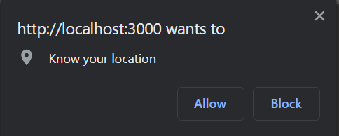
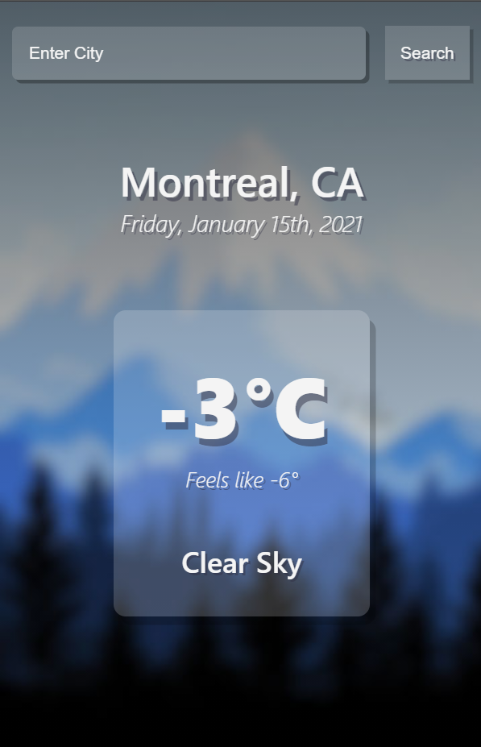
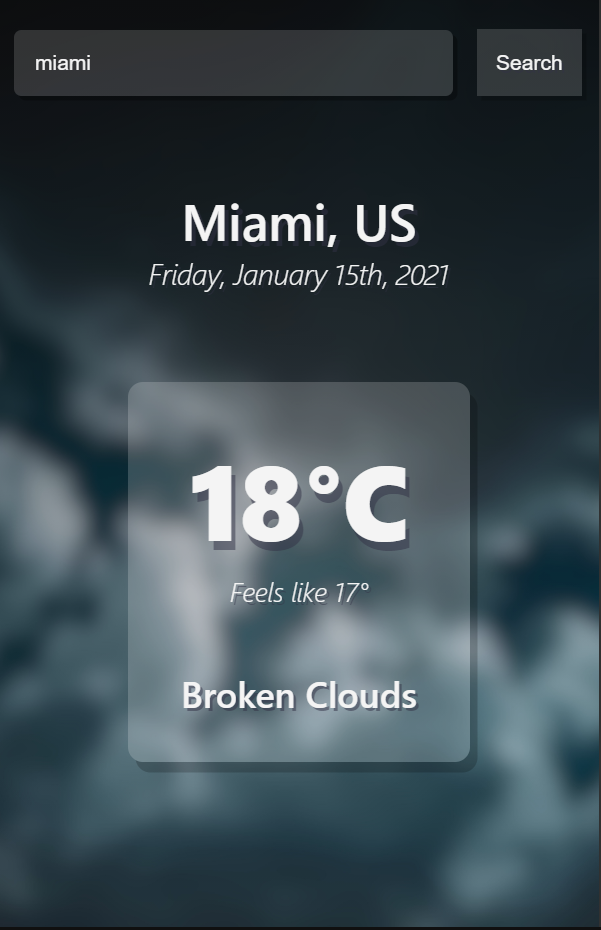
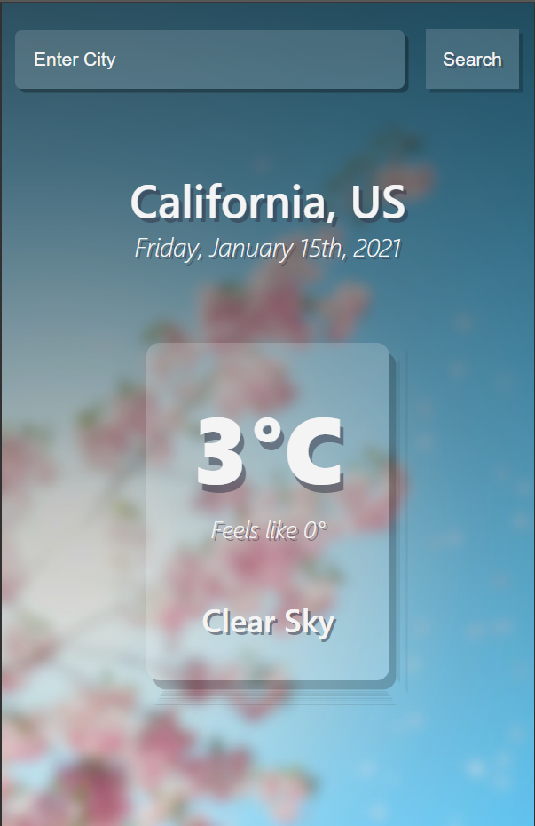
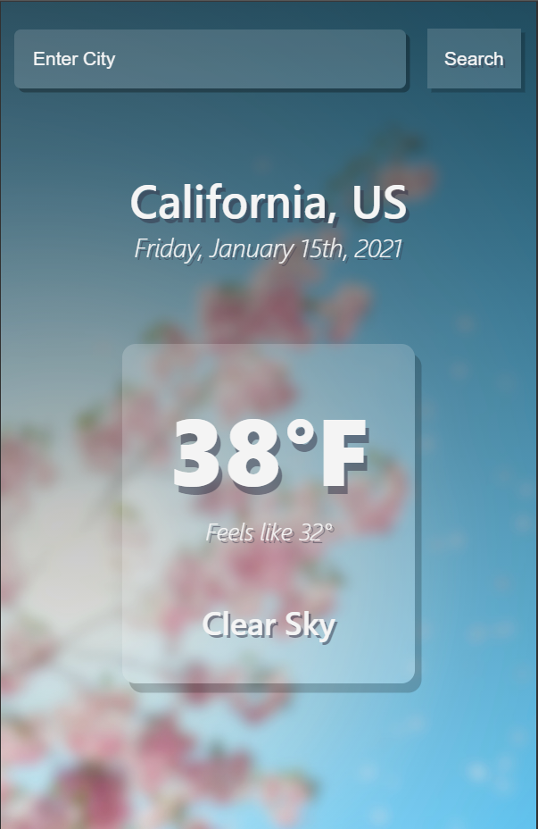

## Weather app using React

### How to Run

1. Go to <a href='https://api.openweathermap.org/' target='_blank'/>https://api.openweathermap.org/<a> and get your api key.

2. Go to App.jsx and in line 5, replace **${process.env.REACT_APP_API_KEY}** with your api key.

3. run <i>npm install && npm start</i>

 

### Description

#### - Uses geolocation as well as search functions to display appropriate temperatures for any city.

 

   

#### - Background image will change depending on weather conditions.

 

  

#### - Option to switch between celsius and fahrenheit by clicking on the temperature box.

 

 
